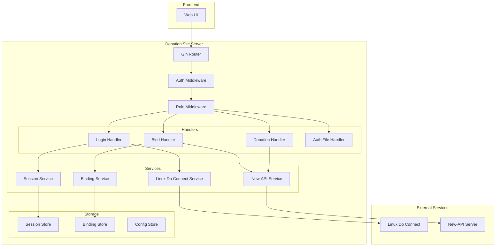

# Design Document: Donation Site

## Overview

本设计文档描述了基于CLIProxyAPI项目改造的捐赠站点系统架构。系统将复用CLIProxyAPI的核心框架（Gin路由、配置管理、认证中间件），并新增Linux Do Connect OAuth登录、new-api用户绑定、捐赠流程处理和访问控制等功能模块。

### 设计原则

1. **最小改动原则**：尽量复用现有代码结构，减少对原有功能的影响
2. **安全优先**：所有敏感操作在后端验证，不依赖前端
3. **配置驱动**：通过配置文件和环境变量管理外部服务凭据
4. **可测试性**：核心逻辑与外部依赖解耦，便于单元测试

## Architecture



## Components and Interfaces

### 1. Linux Do Connect Service

负责与Linux Do Connect OAuth服务交互。

```go
// LinuxDoConnectConfig 配置结构
type LinuxDoConnectConfig struct {
    ClientID     string `yaml:"client-id"`
    ClientSecret string `yaml:"client-secret"`
    RedirectURI  string `yaml:"redirect-uri"`
    AuthURL      string `yaml:"auth-url"`      // 默认: https://connect.linux.do/oauth2/authorize
    TokenURL     string `yaml:"token-url"`     // 默认: https://connect.linux.do/oauth2/token
    UserInfoURL  string `yaml:"userinfo-url"`  // 默认: https://connect.linux.do/api/user
}

// LinuxDoUser 用户信息
type LinuxDoUser struct {
    ID       int    `json:"id"`
    Username string `json:"username"`
    Name     string `json:"name"`
    Email    string `json:"email"`
    Avatar   string `json:"avatar_url"`
}

// LinuxDoConnectService 接口
type LinuxDoConnectService interface {
    // GenerateAuthURL 生成OAuth授权URL
    GenerateAuthURL(state string) (string, error)
    
    // ExchangeToken 用授权码交换访问令牌
    ExchangeToken(ctx context.Context, code string) (*oauth2.Token, error)
    
    // GetUserInfo 获取用户信息
    GetUserInfo(ctx context.Context, token *oauth2.Token) (*LinuxDoUser, error)
}
```

### 2. New-API Service

负责与new-api服务交互，包括用户验证和额度管理。

```go
// NewAPIConfig 配置结构（从环境变量读取）
type NewAPIConfig struct {
    BaseURL    string // 环境变量: NEW_API_BASE_URL
    AdminToken string // 环境变量: NEW_API_ADMIN_TOKEN
}

// NewAPIUser new-api用户信息
type NewAPIUser struct {
    ID          int    `json:"id"`
    Username    string `json:"username"`
    LinuxDoID   string `json:"linux_do_id"`
    Quota       int64  `json:"quota"`
}

// NewAPIService 接口
type NewAPIService interface {
    // GetUserByID 根据用户ID获取用户信息
    GetUserByID(ctx context.Context, userID int) (*NewAPIUser, error)
    
    // AddQuota 为用户增加额度
    AddQuota(ctx context.Context, userID int, amount int64) error
}
```

### 3. Session Service

管理用户会话，使用内存存储（可扩展为Redis）。

```go
// Session 会话结构
type Session struct {
    ID           string    `json:"id"`
    LinuxDoID    int       `json:"linux_do_id"`
    Username     string    `json:"username"`
    Role         string    `json:"role"`         // "user" 或 "admin"
    NewAPIUserID int       `json:"newapi_user_id,omitempty"`
    CreatedAt    time.Time `json:"created_at"`
    ExpiresAt    time.Time `json:"expires_at"`
}

// SessionService 接口
type SessionService interface {
    // Create 创建新会话
    Create(ctx context.Context, user *LinuxDoUser, role string) (*Session, error)
    
    // Get 获取会话
    Get(ctx context.Context, sessionID string) (*Session, error)
    
    // Update 更新会话
    Update(ctx context.Context, session *Session) error
    
    // Delete 删除会话
    Delete(ctx context.Context, sessionID string) error
    
    // GenerateToken 生成安全的会话令牌
    GenerateToken() (string, error)
}
```

### 4. Binding Service

管理用户绑定关系的持久化存储。

```go
// UserBinding 用户绑定关系
type UserBinding struct {
    LinuxDoID    int       `json:"linux_do_id"`
    NewAPIUserID int       `json:"newapi_user_id"`
    BoundAt      time.Time `json:"bound_at"`
}

// BindingService 接口
type BindingService interface {
    // GetByLinuxDoID 根据Linux Do ID获取绑定
    GetByLinuxDoID(ctx context.Context, linuxDoID int) (*UserBinding, error)
    
    // Create 创建绑定
    Create(ctx context.Context, binding *UserBinding) error
    
    // Delete 删除绑定
    Delete(ctx context.Context, linuxDoID int) error
}
```

### 5. Auth Middleware

基于会话的认证中间件。

```go
// AuthMiddleware 认证中间件
func AuthMiddleware(sessionService SessionService) gin.HandlerFunc {
    return func(c *gin.Context) {
        // 1. 从Cookie获取session_id
        // 2. 验证会话有效性
        // 3. 将会话信息存入Context
        // 4. 无效则返回401
    }
}

// RoleMiddleware 角色验证中间件
func RoleMiddleware(requiredRole string) gin.HandlerFunc {
    return func(c *gin.Context) {
        // 1. 从Context获取会话
        // 2. 验证角色权限
        // 3. 不满足则返回403
    }
}
```

## Data Models

### 配置文件扩展

在`config.yaml`中添加以下配置：

```yaml
# Linux Do Connect OAuth配置
linux-do-connect:
  client-id: "your-client-id"
  client-secret: "your-client-secret"
  redirect-uri: "http://your-domain/linuxdo/callback"
  auth-url: "https://connect.linux.do/oauth2/authorize"
  token-url: "https://connect.linux.do/oauth2/token"
  userinfo-url: "https://connect.linux.do/api/user"

# 管理员配置
admin-linux-do-ids:
  - 12345
  - 67890

# 捐赠配置
donation:
  quota-amount: 2000000  # $20 = 2000000 (以最小单位存储)
```

### 环境变量

```bash
# New-API管理员令牌
NEW_API_ADMIN_TOKEN=sk-xxxxxxxxxxxx

# New-API基础URL
NEW_API_BASE_URL=http://localhost:3000
```

### 绑定数据存储

使用JSON文件存储绑定关系（位于`auth-dir`目录下）：

```json
// bindings.json
{
  "bindings": [
    {
      "linux_do_id": 12345,
      "newapi_user_id": 1,
      "bound_at": "2026-01-02T10:00:00Z"
    }
  ]
}
```

## Correctness Properties

*A property is a characteristic or behavior that should hold true across all valid executions of a system-essentially, a formal statement about what the system should do. Properties serve as the bridge between human-readable specifications and machine-verifiable correctness guarantees.*

### Property 1: OAuth重定向URL格式正确性

*For any* 有效的state参数，生成的OAuth授权URL应包含正确的client_id、redirect_uri、response_type和state参数。

**Validates: Requirements 1.2**

### Property 2: 配置文件解析正确性

*For any* 包含linux-do-connect配置的有效YAML文件，解析后的LinuxDoConnectConfig结构应正确包含client_id、client_secret和redirect_uri字段。

**Validates: Requirements 2.1, 2.2, 2.3**

### Property 3: 用户ID匹配验证正确性

*For any* 用户提交的New_API_User_ID和当前登录用户的Linux_Do_ID，当且仅当New_API返回的linux_do_id与当前用户匹配时，绑定操作才应成功。

**Validates: Requirements 3.4, 3.5**

### Property 4: 绑定数据持久化往返一致性

*For any* 有效的UserBinding对象，保存后再读取应得到等价的对象。

**Validates: Requirements 3.7**

### Property 5: 普通用户Auth_File访问控制

*For any* 角色为"user"的会话，对Auth_File相关接口（列表、下载、上传、删除）的请求都应返回403状态码。

**Validates: Requirements 6.1, 6.2, 6.3, 6.4**

### Property 6: 管理员Auth_File访问权限

*For any* 角色为"admin"的会话，对Auth_File相关接口的请求应正常处理（不返回403）。

**Validates: Requirements 6.5**

### Property 7: 会话令牌安全性

*For any* 生成的会话令牌，其长度应至少为32字节，且不同调用生成的令牌应不相同。

**Validates: Requirements 7.1**

### Property 8: 会话验证正确性

*For any* 请求，当会话令牌无效或过期时应返回401状态码，当会话有效时应允许继续处理。

**Validates: Requirements 7.3, 7.4**

### Property 9: 默认用户角色分配

*For any* 通过Linux Do Connect登录的新用户，如果其Linux_Do_ID不在管理员列表中，应被分配"user"角色。

**Validates: Requirements 8.2**

### Property 10: 管理员角色分配

*For any* 通过Linux Do Connect登录的用户，如果其Linux_Do_ID在管理员列表中，应被分配"admin"角色。

**Validates: Requirements 8.4**

### Property 11: New-API请求认证头

*For any* 对New-API的请求，请求头中应包含正确格式的Authorization头（Bearer token）。

**Validates: Requirements 4.4**

### Property 12: 捐赠日志完整性

*For any* 捐赠操作，日志记录应包含时间戳、用户ID和额度变更金额。

**Validates: Requirements 5.5**

### Property 13: 日志敏感信息过滤

*For any* 日志输出，不应包含admin_token、client_secret等敏感信息。

**Validates: Requirements 9.5**

## Error Handling

### OAuth错误处理

| 错误场景 | 错误码 | 处理方式 |
|---------|-------|---------|
| 授权被拒绝 | 400 | 显示错误信息，提供重试链接 |
| 授权码无效 | 400 | 显示错误信息，提供重试链接 |
| 令牌交换失败 | 500 | 记录日志，显示通用错误 |
| 获取用户信息失败 | 500 | 记录日志，显示通用错误 |

### New-API错误处理

| 错误场景 | 错误码 | 处理方式 |
|---------|-------|---------|
| 用户不存在 | 404 | 显示"用户不存在"错误 |
| Linux Do ID不匹配 | 403 | 显示"身份验证失败"错误 |
| Admin Token无效 | 500 | 记录日志，显示通用错误 |
| 额度增加失败 | 500 | 记录日志，提示人工处理 |

### 会话错误处理

| 错误场景 | 错误码 | 处理方式 |
|---------|-------|---------|
| 会话不存在 | 401 | 清除Cookie，重定向到登录 |
| 会话过期 | 401 | 清除Cookie，重定向到登录 |
| 权限不足 | 403 | 显示权限不足错误 |

## Testing Strategy

### 单元测试

使用Go标准测试框架，针对以下组件编写单元测试：

1. **配置解析测试**：验证YAML配置正确解析
2. **会话服务测试**：验证会话创建、验证、过期逻辑
3. **绑定服务测试**：验证绑定数据的CRUD操作
4. **角色判断测试**：验证管理员列表匹配逻辑
5. **中间件测试**：验证认证和角色中间件行为

### 属性测试

使用`gopter`库进行属性测试，每个属性测试运行至少100次迭代：

1. **Property 1**: 生成随机state，验证URL格式
2. **Property 2**: 生成随机配置YAML，验证解析结果
3. **Property 3**: 生成随机ID组合，验证匹配逻辑
4. **Property 4**: 生成随机绑定数据，验证往返一致性
5. **Property 5-6**: 生成随机角色和请求，验证访问控制
6. **Property 7**: 多次生成令牌，验证唯一性和长度
7. **Property 8**: 生成随机会话状态，验证验证逻辑
8. **Property 9-10**: 生成随机用户ID和管理员列表，验证角色分配
9. **Property 11**: 验证请求头格式
10. **Property 12-13**: 验证日志内容

### 集成测试

由于无法本地运行，集成测试将在部署后进行手动验证：

1. 完整OAuth登录流程
2. 用户绑定流程
3. 捐赠流程
4. 访问控制验证

